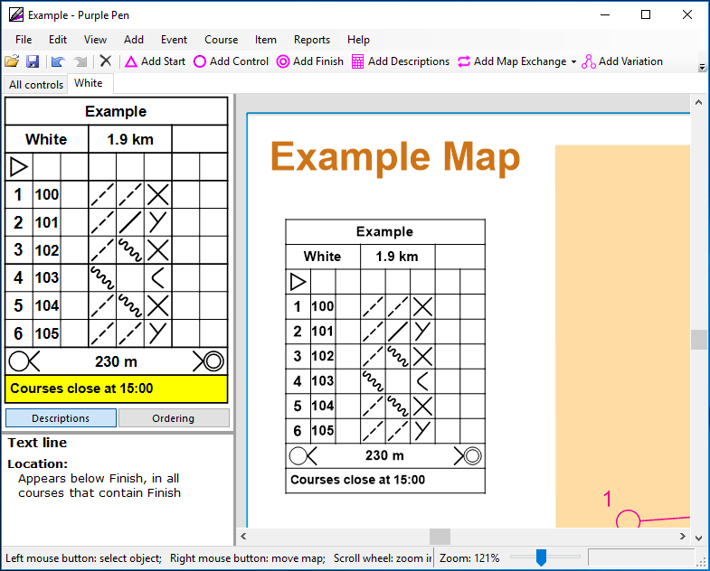

# Course closing time
Decide on a course closing time. Competitors need to be back by this time, and the controls can start being collected.

Add the course closing time as the last line in the control descriptions.

1. Click the last line of the control descriptions in the left hand pane
1. Add > Text Line...
1. Enter some text - e.g. `Courses close at 14:00`
1. Check `Position:` is `Below finish`
1. Click ok

