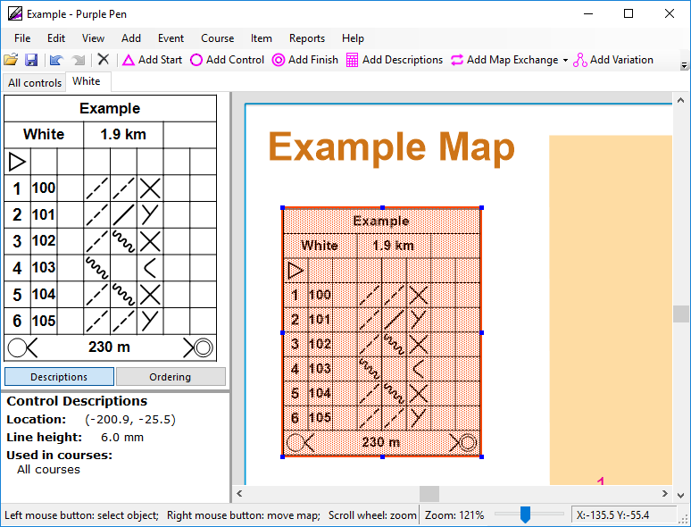

#Control descriptions size

The box size of the control descriptions should be between 5 and 7mm when printed.

1. Click the control description block
1. The line height is shown in the bottom left corner of Purple Pen
1. Resize the descriptions

