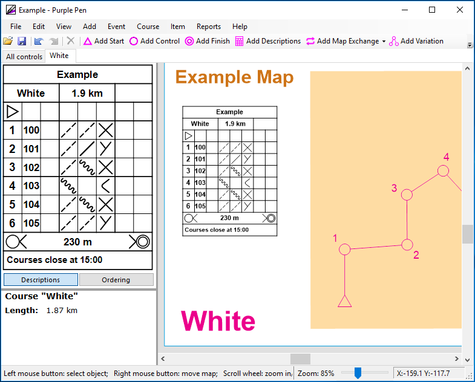

# Add course name
It might be useful to add the course name in large pink letters somewhere on the map.

This allows competitors to easily check they have the correct map at the start.

1. On the toolbar: Add special item > Text
1. Insert special text > Course name
1. Click `Ok`
1. Drag a box to make the text appear
1. Resize / move the text as appropriate

