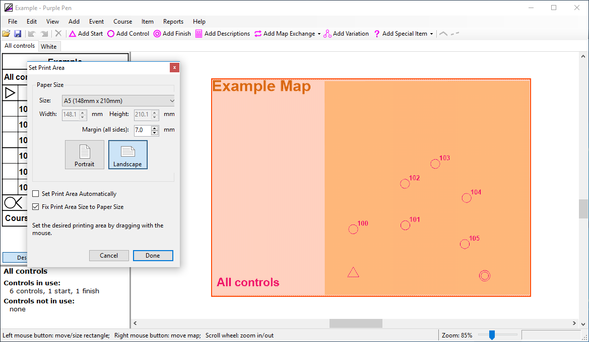

# Page margins
The page margins should be at least 5mm (recommended 7mm) to ensure nothing gets cut off by the printer.

1. File > Set Print area
2. Choose either `This course` or `All courses`
3. Set the print margin
4. Ensure the `Fix print area size to paper size` checkbox is checked
5. Ensure the page orientation is correct
6. Drag the print area rectangle to include the wanted area

It is important to make sure that the `Fix print area size to paper size` checkbox is checked. 
Otherwise the print area will be different from the paper size, and some of the map
may get cut off when printed.
