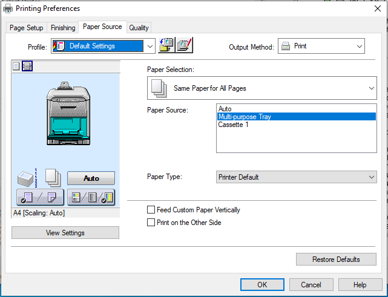

# Paper

## Feeding paper

The printer has two ways paper can be fed. There is a tray (cassette) at the bottom
of the printer, and a fold out flap (manual feed/multi-purpose tray).

I had normal (non-waterproof) paper in the cassette which was used for test prints
or anything which didn't need waterproof paper. Waterproof paper doesn't work
well in the cassette and will lead to frequent paper jams.

Waterproof paper can be used with the manual feeder. **The individual sheets of paper must be separated**
before being placed into the feeder - otherwise multiple sheets may stick together and be pulled into
the printer - causing a paper jam. I normally separated about 10 sheets at a time and placed
them into the manual feeder.

## Selecting paper source

Sometimes the printer will automatically detect the paper source. If there's no
paper in the manual feed it should use the cassette. However, if that doesn't work 
the paper source can be set explicitly in the printer preferences.

1. File > Print courses
2. Click `Change printer...` button
3. Select the printer and click `Preferences`
4. Go to the `Paper source` tab
5. Pick from the available paper sources

