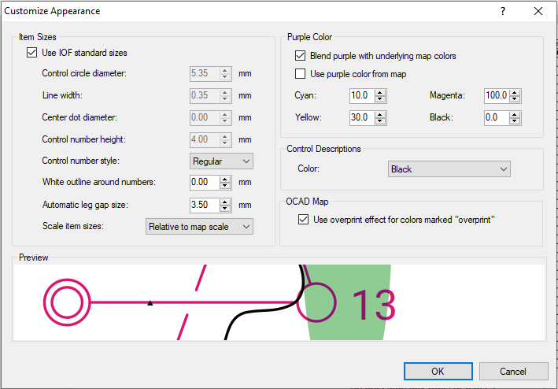

# Purple overprint colour

The course may be easier to read if the colour of the purple overprint is changed.

The recommended CMYK colour is 10, 100, 30, 0.
 
1. Event > Customize Appearance
2. Unchecked the `Use purple colour from map` checkbox
3. Enter values for a custom colour in the CYMK fields

